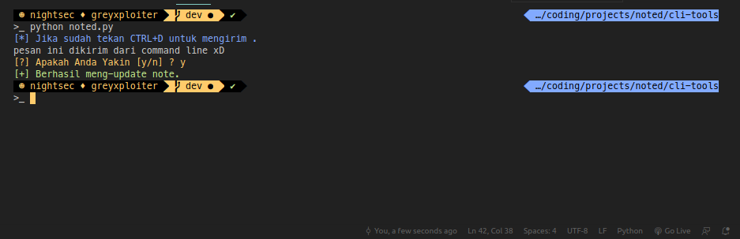

# Simple Github Page Noted
Sebuah repository yang dapat digunakan untuk catatan ketika gabut / menjadi tempat curhat dikala galau :)

## Cara Menggunakan

* Fork repository ini
```
https://github.com/defrindr/noted.git
```
* Aktifkan github page. untuk tutorial nya bisa di lihat [disini](https://help.github.com/en/github/working-with-github-pages/configuring-a-publishing-source-for-your-github-pages-site) (*nb: Gunakan Master sebagai source)

Untuk mengubah konfigurasi bisa dilihat di ```config.json```

Untuk menambahkan note bisa menuju ke ```assets/noted/source.json```

## CLI Required
* python3

## Menggunakan CLI untuk menambahkan note


* Buka directory ```cli-tools```
```
cd cli-tools
```
* Install requirements
```
pip install requirements.txt
```
* Masukkan token & username github kalian ke ```cli-tools/config.json```
    * Untuk mendapatkan token bisa dilihat [disini](https://help.github.com/en/github/authenticating-to-github/creating-a-personal-access-token-for-the-command-line)

* Jalankan ```noted.py```
```
python noted.py
```


## Kontribusi
Akan terasa sangat menyenangkan jika kalian dapat membantu mengembangkan repository ini. Saya akan sangat berterimakasih untuk itu.

